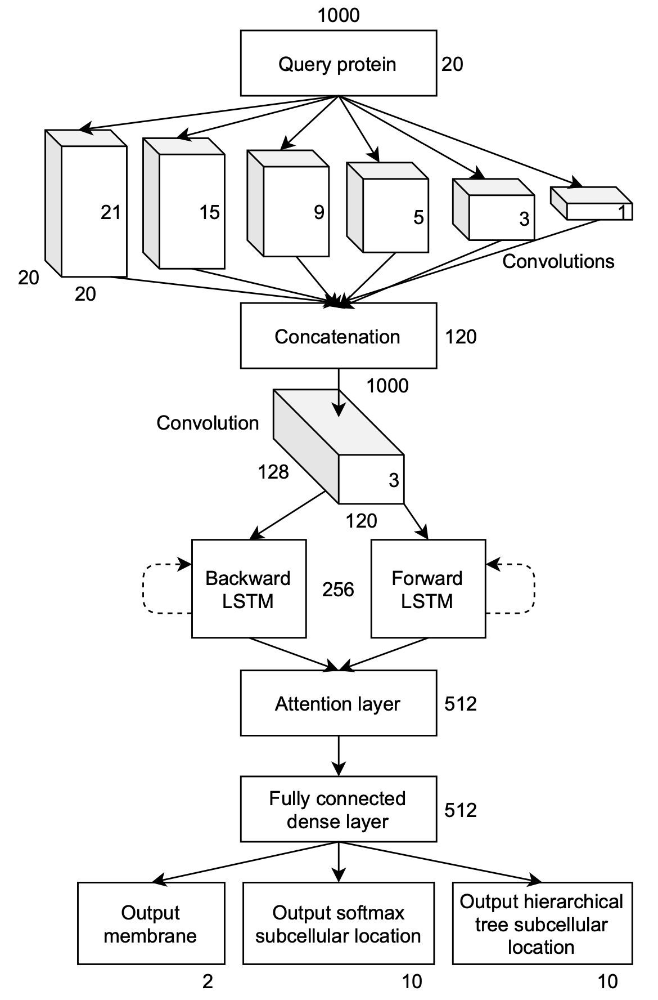
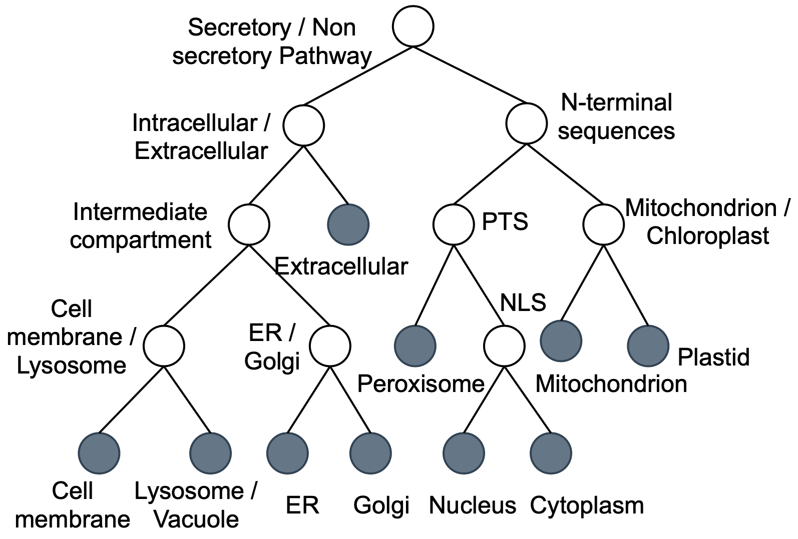

# Protein subcellular localization

[](https://www.python.org/downloads/release/python-385/)

## Overview
**Subcellular localization** is a multi-class classification problem where a protein sequence is assigned to one of different cell compartments. Proteins are produced in specific zones and trasported somewhere else to fulfill its purpose. Where proteins are released is determined by specific tags or signals present in the amino acids chain that makes up the actual protein. This signals are usually found at the beginning (N-terminus) or at the end (C-terminus) of the sequence. 
In our work we will consider the classification in 10 different classes of subcellular localization as well as the classification in **membrane bound vs water soluble proteins**.
The classifications were performed through a **Recurrent Neural Network (RNN)** which in general is used for ordinal or temporal problems when data is sequential. Info from prior inputs (memory) is used to influence current input and output.

For a detailed description of the experiments and results obtained refer to the project [presentation](https://github.com/ClaudiaRaffaelli/Protein-subcellular-localization/blob/master/Presentation.pdf).
This work is based on the article by Almagro et al. [1]. 

### Datasets
The experiments are conducted on the following datasets:
- **DeepLoc** [1][3], an homology reduced dataset (to 30% of identity). The **homology** in a sequence of proteins is defined in terms of shared ancestors in the evolutionary history of that animal or plant. Homology can be inferred through the similarity of amino acid sequences usually. Having a dataset with high homology spread between train-validation-test, leads to more optimistic results due the network being tested on similar sequences to the ones learned through train. DeepLoc has been clustered as to reduce its homology among train-test-validation.
- **Multiloc** [4], with an homology reduced to 80% of identity.

### Experiments
#### Models comparison
To perform the task of classification in subcellular localization and membrane-soluble we developed a few network architectures trained on the DeepLoc dataset. In particular the built networks as the following:
- Feed-Forward Network (FFN),
- Convolutional Neural Network (CNN),
- Bidirectional Long-Short Term Memory (BLSTM),
- Convolutional BLSTM (CNN BLSTM),
- BLSTM with Attention (BLSTM-A),
- Convolutional BLSTM with Attention (CNN BLSTM-A)

The **convolutional** layers are placed in such a way as to recognize motifs of specific good lengths. **Motifs** are amino acid arrangements preserved among members of the same protein family and useful for assigning a function to a particular protein sequence. 
Some types of motifs found in the middle of the sequence are also highly correlated with the destination codons of the protein, so being able to identify these also leads to localization benefits.
 
We also used **LSTM** layers that were born to solve the problem of long term dependencies that could be penalized by the vanishing gradient. Information at the beginning of the sequence is no longer preserved with a normal RNN and older inputs are easily forgotten. Since the most important parts of the sequence are at the beginning and at the end, LSTM are crucial.
The sequence is scanned in both directions with a **Bidirectional LSTM** so that the information from the N and C terminus is preserved.

Finally, another layer is the **Bahdanau Attention**, also known as additive attention. The idea here is to further improve the approach of LSTM going to pay more attention on those words (amino acids) more relevant for the task of localization.

The networks have been trained for 120 epochs after choosing the best hyperparameters with **random search** and keeping the top results found across the epochs. The dataset has been configured in different ways:
- **DeepLoc paper 400**: is the pre-processed dataset made available in [1] whose protein are encoded using either BLOSUM64, PSI-BLAST or a different encoding. Also the proteins are reduced to a lenght of 400, removing the amino acids from the center of the sequence, so as to preserve the important information at the N and C terminus. If the protein was smaller than 400 a padding is added. It was only available for the task of subcellular localization.
- **Our one-hot 400**: is the DeepLoc dataset that we have encoded with one-hot encoding of the amino acids.
- **Our psi blast 400**: is the DeepLoc dataset that we have encoded with PSI-BLAST. **PSI-BLAST** compares the sequence of a protein within DNA databases looking for similarities in the sequence itself. It then assigns the best result found in the database of annotated examples. This is based on the assumption that proteins that are similar on evolutionarily level tend to be in the same compartment and thus can be classified into the same class of localization. Thus, with PSI-BLAST it is possible to obtain score matrices, based on position or profiles, resulting from multiple alignments of a reference protein with others contained in the database. This seems to be more effective than a simple one-hot encoding.

The best results are achieved by **CNN LSTM Attention** network.

#### Best model performances
CNN LSTM Attention model has proven to be the best performing model and for this reason its architecture has been further improved and it has been re-trained to obtain the best possible results.
The architecture of this complete network is shown in the figure below. 

<p float="left" align="center">
  
</p>

The training was done with 4fold-validation on 200 epochs. For each fold the best hyperparameters have been found using both random search and **bayesian optimization**. The datasets were configured in the following way:
- **DeepLoc paper 1000**: made available in [1] with proteins long 1000 amino acids, treated the same way as the 400.
- **Our Psi-blast 1000**: again obtained in a similar way as the 400.

Alongside the two softmax outputs (the one for membrane-soluble and subcellular localization) is added a third one: a hierarchical tree of sorting pathways, which is an alternative method to softmax for subcellular localization. It is composed of a dense layer with 9 nodes, in the next figure the white nodes carry the sigmoid activation function, used to make decisions. These decisions are based on the conditional probability of going through each of these nodes. The 10 black nodes represent the output classes. The results are equivalent to the plain softmax that was preferred later. 
<p float="left" align="center">
  
</p>

#### Generalization test
To prove the better generalization of DeepLoc over Multiloc, CNN LSTM Attention complete was trained on both our PSI-Blast DeepLoc 1000 and PSI-Blast Multiloc 1000 for 120 epochs with random search as hyperparameters optimization strategy. Both this two networks were then tested on test data from DeepLoc and from Multiloc, obtaining four different configurations. 

#### ELMo embeddings
Proteins could also be considered as sentences in a Natural Language Processing (NLP) task, and in which n-grams with a certain stride of amino acids, make up the words. **ELMo** [5] is a way to represent words in vectors or embeddings. The bidirectional language model (biLM) which uses two BLSTM in its architecture, allows to obtain a contextualized representation of each word.
After downloading the Tensorflow version of biLM [6] we pre-trained the network from scratch using Swiss-Prot dataset [7], or also using checkpoints from a previous training on UniRef50 available here [8] to obtain more robust results. After pre-train were computed the ELMo embeddings on the DeepLoc datasets, which were used as dataset to train the same CNN LSTM Attention network. 
The experiment involved the training upon different combinations of n-grams lengths, and stride to find the best one. For some configuration the performances improved considerably. 

## Repository structure
The respository is structured as follows:
- The ```dataset/``` folder contains all the datasets used during the course of experiments. All the datasets are in ```.npz``` format, ready to use. 
- The ELMo datasets in ```dataset/ELMo/``` are in folders named as ```embeddings_x_y``` where ```x``` is the n-grams lenght and ```y``` the stride. 
- The file ```models.py``` contains all the models used during the models comparison experiment as well as the complete network. It also contains a few functions to plot some evaluation graphs.
- The file ```utils/mergeMultiloc.py``` is a simple script used to merge the Multiloc ```.fasta``` files downloaded that were splitted by class.
- The file ```utils/ncbi-blast/getPSSM.py``` computes the pssm matrices for psi-blast profiles given a dataset of protein sequences. 
- The files ```utils/datasetOnehot.py``` and ```utils/datasetPSSM.py``` create either one-hot or psi-blast ```.npz``` datasets. In the latter case the script goes through all the pssm matrices to do so. 
- The notebook ```random_search_results.ipynb``` holds all the results of the network comparisons optimized with random search.
- The script ```rs_cnn_lstm_attention_complete.py``` performs random search on the complete network.

## Bibliography
\[1\] Almagro Armenteros JJ, Sønderby CK, Sønderby SK, Nielsen H, Winther O. DeepLoc: prediction of protein subcellular localization using deep learning. Bioinformatics. 2017 Nov 1;33(21):3387-3395. doi: [10.1093/bioinformatics/btx431](https://doi.org/10.1093/bioinformatics/btx431). Erratum in: Bioinformatics. 2017 Sep 19;: PMID: 29036616.

 \[2\] Khan Academy. [DNA to RNA to protein](https://www.khanacademy.org/science/biology/gene-expression-central-dogma/translation-polypeptides/v/rna-transcription-and-translation)
 
 \[3\] Jose Armenteros et al. [DeepLoc dataset](http://www.cbs.dtu.dk/services/DeepLoc/data.php).
 
 \[4\] Annette Höglund et al. “MultiLoc: prediction of protein subcellularlocalization using N-terminal targeting sequences, sequence motifsand amino acid composition”. In:Bioinformatics (Oxford, England)22 (June 2006), pp. 1158–65. [doi:10.1093/bioinformatics/btl002](https://doi.org/10.1093/bioinformatics/btl002).
 
 \[5\] Matthew E. Peters et al. Deep contextualized word representations. 2018. [arXiv:1802.05365](https://arxiv.org/abs/1802.05365).
 
 \[6\] AllenAI. Bidirectional language model. url: [https://github.com/allenai/bilm-tf](https://github.com/allenai/bilm-tf).
 
 \[7\] UniProt datasets download [https://www.uniprot.org/downloads](https://www.uniprot.org/downloads)
 
 \[8\] Michael Heinzinger et al. “Modeling aspects of the language of lifethrough transfer-learning protein sequences”. In:BMCbioinformatics20.1 (2019), p. 723. [Repository](https://github.com/mheinzinger/SeqVec)

## Acknowledgments
Machine Learning project - Computer Engineering Master Degree @[University of Florence](https://www.unifi.it/changelang-eng.html)
